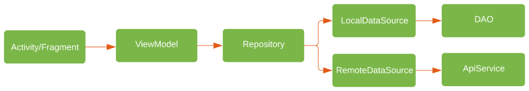

# Events Sample Android

## Introduction
**Events Sample** is a playground application where I play with new android libraries and implementations.

## Architecture
The app uses **MVVM** as its architecture, as Google's own recommendation.

## Frameworks
- [Coroutines](https://github.com/Kotlin/kotlinx.coroutines)
- [Koin](https://github.com/InsertKoinIO/koin)
- [Glide](https://github.com/bumptech/glide)
- [Lottie](https://github.com/airbnb/lottie-android)
- [Retrofit](https://github.com/square/retrofit)
- [Mockito](https://site.mockito.org/)
- [Robolectric](https://github.com/robolectric/robolectric)
- [AndroidX](https://developer.android.com/jetpack/androidx?authuser=1)

## Preview

> **Note:** As it is a GIF, there is a limitation on the amount of colors ...